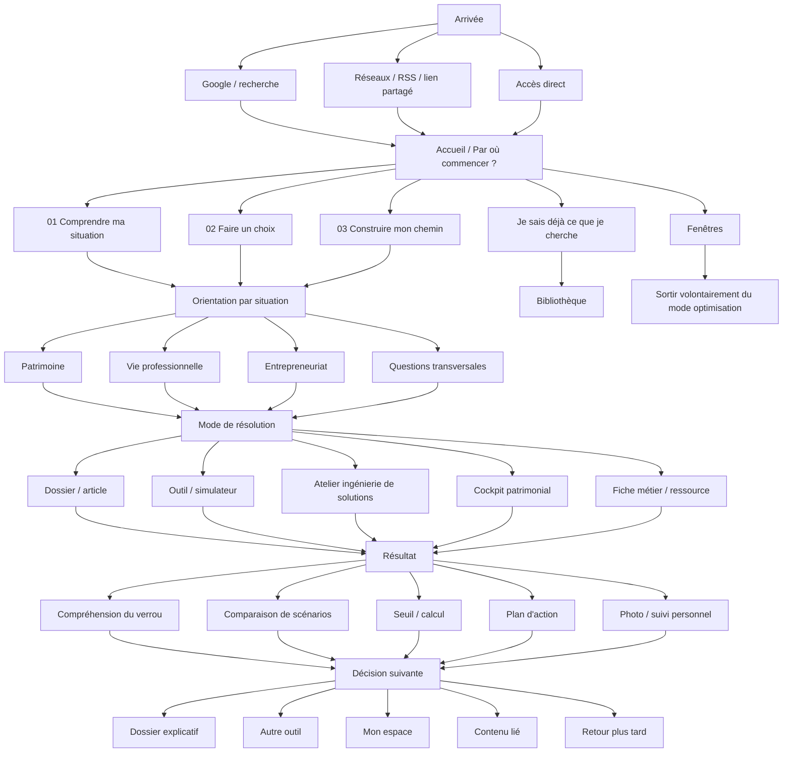
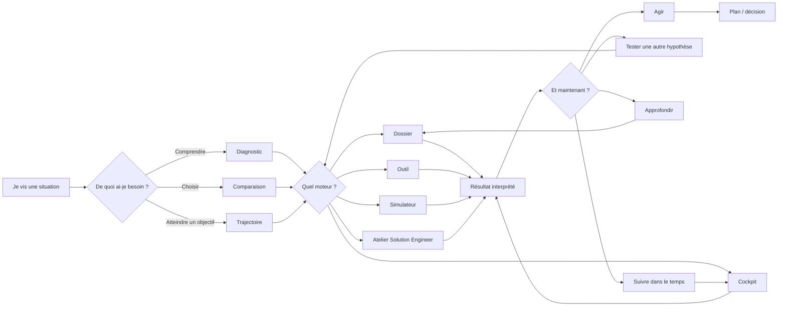

# Contre-Évidence — Cartographie fonctionnelle

Mise à jour : 16 août 2026

## 1. Ce que devient Contre-Évidence

Contre-Évidence n'est plus seulement un média pédagogique organisé par thèmes. Le produit évolue vers une **plateforme d'aide à la décision** où le contenu explique le système, les outils appliquent le raisonnement aux données du visiteur et les parcours orientent vers la prochaine décision utile.

Le parcours cible reste :

**arrivée → situation vécue → diagnostic / arbitrage / objectif → terrain concerné → outil ou dossier → résultat personnel → décision suivante → approfondissement / suivi**

L'architecture doit donc être jugée sur sa capacité à répondre à trois questions :

1. Le visiteur comprend-il rapidement **où entrer** ?
2. Obtient-il autre chose qu'une information — **un diagnostic, une comparaison, un seuil ou une prochaine action** ?
3. Sait-il **quoi faire ensuite** sans repartir de zéro ?

---

## 2. Carte globale du produit

---

## 3. Les quatre couches d'entrée

### Couche A — le besoin avant le domaine

L'accueil et `parcours-de-vie.html` portent maintenant correctement la logique :

- **Comprendre ma situation** ;
- **Faire un choix** ;
- **Construire mon chemin** ;
- ou accéder directement à la Bibliothèque si le sujet est déjà connu.

C'est la porte principale du produit. Elle évite d'obliger un visiteur à connaître la taxonomie du site avant de savoir ce qu'il cherche.

### Couche B — les terrains

#### Patrimoine

Hub : `themes/argent.html`

Fonction : du premier budget au pilotage global.

Trajectoire visible :

1. **poser les bases** ;
2. **faire grandir le patrimoine** ;
3. **organiser l'ensemble** via le cockpit.

Sous-systèmes : budget / liquidités / crédit / immobilier / investissement / allocation / retraite / transmission.

#### Vie professionnelle

Hub : `parcours-vie-professionnelle.html`

Fonction : résoudre le problème du moment sans perdre de vue la trajectoire professionnelle.

Deux entrées fortes :

1. **où va ma vie professionnelle ?**
2. **quel problème dois-je régler maintenant ?**

Sous-systèmes : recherche d'emploi / retour / offres / contrat / salaire / compétences / évolution / reconversion / management / santé / départ / temps.

#### Entrepreneuriat

Hub : `themes/entreprendre.html`

Fonction : tester, lancer, rendre viable puis développer une activité.

Séquence actuelle :

**marché → premiers clients → économie unitaire → prévisionnel → financement / sécurité → statut → trésorerie → capacité → développement**.

Entrepreneuriat est aujourd'hui **fonctionnellement un terrain autonome**, mais **navigationnellement rattaché à Vie professionnelle**. Ce choix doit rester volontaire : il évite de multiplier les grandes rubriques, mais il ne faut pas laisser ce terrain devenir invisible.

#### Fenêtres

Hub : `hors-cadre.html`

Fonction volontairement différente : sortir du mode décision / optimisation. Cette branche ne doit pas être forcée dans la logique utilitaire du reste du produit.

---

## 4. Couche transversale — là où Contre-Évidence est le plus différenciant

Les situations importantes traversent plusieurs domaines à la fois :

- changer de travail **et** obtenir un crédit ;
- travailler moins **et** utiliser son patrimoine ;
- déménager pour un emploi **et** revoir son logement ;
- se séparer **et** sortir d'une indivision ;
- lancer une activité **sans** détruire trop tôt la sécurité salariale ;
- choisir à deux lorsqu'une décision transfère temps, revenu ou risque à l'autre ;
- utiliser de l'argent pour racheter du temps ou de la qualité de vie.

Cette couche n'est pas un troisième domaine. C'est une **couche de recombinaison** : elle relie les domaines lorsque le problème réel ne respecte pas la taxonomie du site.

C'est ici que l'ingénierie de solutions doit être la plus visible.

---

## 5. Les moteurs de résolution

### 5.1 Contenus explicatifs

Rôle : comprendre le système, déconstruire un faux verrou, montrer les variables, les seuils et les voies possibles.

Formats : dossiers, articles, fiches métiers.

### 5.2 Outils et simulateurs

Le produit a dépassé la première cartographie de cinq outils. Le dépôt contient désormais **10 pages `outil-*` et 18 pages `simulateur-*`**, soit **28 outils / simulateurs fonctionnels** au niveau racine.

Ils doivent désormais être cartographiés par **fonction de décision**, pas seulement par domaine.

#### Diagnostic

- audit financier personnel ;
- capital professionnel ;
- microscope PEA ;
- ingénierie de solutions.

#### Preuve / traduction

- compétences → preuves → CV ;
- pilotage de recherche d'emploi.

#### Comparaison / arbitrage

- comparer deux offres d'emploi ;
- acheter ou louer ;
- acheter ou louer avec mobilité ;
- comparer des stratégies immobilières ;
- rembourser ou investir ;
- vendre ou conserver ;
- comparateur de capitalisation.

#### Seuil / condition de possibilité

- capacité d'emprunt ;
- réserve de sécurité ;
- épargne avant démission ;
- salaire minimum pour déménager ;
- coût réel d'un passage à 80 % ;
- coût d'une formation ;
- coût d'un trajet emploi ;
- prix minimum rentable.

#### Scénario / stress test

- allocation / stress test ;
- investissement locatif ;
- prix du fait d'attendre.

#### Planification / pilotage

- plan 30/90 jours ;
- prévisionnel d'activité ;
- trésorerie 13 semaines ;
- répartir une grosse somme.

### 5.3 Mon espace

`mon-espace.html` est actuellement un **cockpit patrimonial local** : flux, actifs, dettes, allocation, scénarios et historique local.

Il joue un rôle différent d'un simulateur ponctuel : il peut devenir la couche de **continuité dans le temps**.

Asymétrie actuelle : cette persistance existe pour le patrimoine, mais pas encore comme équivalent complet pour :

- le capital professionnel ;
- une recherche d'emploi ;
- une transition ;
- un projet entrepreneurial ;
- une décision complexe d'ingénierie de solutions.

Cette asymétrie n'oblige pas à créer cinq cockpits. Elle signale que la continuité utilisateur est aujourd'hui surtout patrimoniale.

### 5.4 Bibliothèque

`bibliotheque.html` n'est pas une page d'orientation primaire. C'est un **moteur de recherche interne** pour un visiteur qui connaît déjà suffisamment son sujet.

Elle sert de couche de récupération : retrouver un contenu ou un outil sans reparcourir les hubs.

---

## 6. Ce qui fonctionne déjà bien

1. **Le besoin précède le domaine.** L'accueil et le parcours général sont alignés.
2. **Patrimoine et Vie professionnelle ont des hubs de maturité / situation**, pas de simples listes d'articles.
3. **Entrepreneuriat a désormais une vraie séquence causale**, du test marché à la capacité.
4. **Les outils ne sont plus décoratifs** : ils couvrent diagnostic, comparaison, seuils, scénarios et planification.
5. **Le cockpit patrimonial donne un début de boucle longitudinale**.
6. **La Bibliothèque est correctement positionnée comme index**, pas comme première expérience obligatoire.
7. **Fenêtres reste séparé du système d'optimisation**, ce qui protège sa fonction.

---

## 7. Les asymétries à traiter maintenant

### A. Le maillon le plus faible : après le résultat

La cartographie cible n'est pas seulement :

**contenu → outil → résultat**.

Elle doit devenir :

**résultat → interprétation → prochaine décision → prochaine ressource**.

La prochaine passe doit donc vérifier, outil par outil, si le visiteur sait immédiatement :

- ce que son résultat signifie ;
- ce qui ferait changer la conclusion ;
- quel dossier lire ensuite ;
- quel autre outil utiliser ;
- ce qui mérite d'être sauvegardé / suivi.

### B. 28 outils sont trop nombreux pour rester une simple catégorie

Le bouton « Outils » ne suffit plus à exprimer la structure du produit.

La taxonomie fonctionnelle à privilégier est :

**Diagnostiquer · Comparer · Calculer un seuil · Tester un scénario · Construire un plan · Piloter dans le temps**.

Le domaine devient un filtre secondaire.

### C. La qualité de vie est la finalité mais pas encore une couche visible

Le site traite déjà salaire, temps, trajet, 80 %, mobilité, couple, patrimoine utilisable et transitions. Mais cette logique apparaît surtout **à l'intersection** des pages.

La cartographie doit considérer **temps / énergie / qualité de vie / liberté de choix** comme une couche transversale d'évaluation, pas nécessairement comme une nouvelle rubrique.

### D. Ingénierie de solutions : moteur central, visibilité encore périphérique

`ingenierie-de-solutions.html` et `outil-ingenierie-solutions.html` existent, mais l'accueil principal ne les présente pas comme une porte majeure.

Décision à examiner : l'ingénierie de solutions doit-elle rester la méthode invisible derrière tout le site, ou devenir aussi une porte explicite pour les problèmes atypiques / bloqués ?

### E. Entrepreneuriat : autonome dans le produit, secondaire dans la navigation

Le hub est riche et structuré, mais le menu principal ne comporte pas « Entreprendre ».

Ce n'est pas automatiquement un défaut. Le choix doit être tranché selon le comportement attendu :

- **rattachement à Vie professionnelle** si l'on veut garder deux grands terrains ;
- **porte explicite** si l'acquisition entrepreneuriale devient assez forte pour justifier son autonomie.

---

## 8. Carte cible de l'expérience utilisateur

---

## 9. Prochaine passe de cartographie

La prochaine cartographie ne doit plus porter sur les pages isolées. Elle doit construire une **matrice Situations × Moteurs × Sorties**.

Pour chaque grande situation :

1. quelle phrase amène le visiteur ?
2. quel diagnostic initial ?
3. quel dossier pivot ?
4. quel outil ou simulateur ?
5. quel résultat personnel ?
6. quelle décision suivante ?
7. quel suivi / retour ?
8. où existe un trou dans la chaîne ?

Priorité de travail :

1. transitions Travail × Patrimoine ;
2. immobilier / indivision / mobilité ;
3. recherche d'emploi / reconversion ;
4. entrepreneuriat ;
5. allocation / grosse somme / retraite ;
6. temps / qualité de vie ;
7. démarches ou situations bloquées nécessitant l'ingénierie de solutions.

---

## 10. Règle produit

Une nouvelle page n'est pas automatiquement une nouvelle brique utile.

Avant de créer un contenu ou un outil, préciser sa position dans cette cartographie :

**situation d'entrée → verrou → moteur → sortie → prochaine décision**.

Si une brique ne modifie aucune étape de cette chaîne, elle risque d'ajouter de la surface au site sans augmenter sa capacité de résolution.
